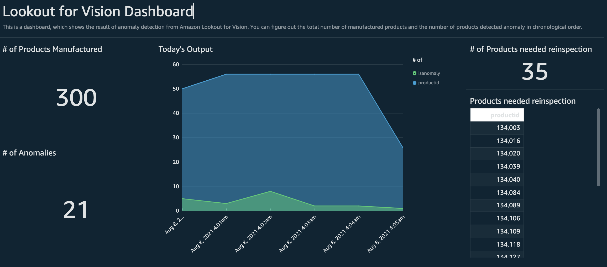

# Amazon Lookout for Vision Workshop

**It is important for manufacturing companies to increase quality and reduce operational costs by quickly identifying anomalies from products. In this workshop, we will spot defects with Amazon Lookout for Vision in real-time and build a dashboard to visualize the results.**

It supposes that a manufacturing plant has a server to collect and process images. The server collects product's images, and send them to Amazon Lookout for Vision to detect defects in real-time. After receiving the result of detection, it saves the result as a csv file and stores in a S3 bucket. Also, we create an alarm to receive notifications when detects are detected.

Amazon Lookout for Vision is now available in 7 regions: us-east-1, us-east-2, us-west-2, eu-central-1, eu-west-1, ap-northeast-1, ap-northeast-2.

Before you start this workshop, please make sure that you run this workshop in one of the regions above, and that all services must be in the same region.

Here is the architecture this workshop covers:

1. A server, EC2 instance, collects images and send them to Amazon S3. 
2. We use the images stored in the S3 bucket to create a model.
3. The instance receives the result of detection from Amazon Lookout for vision. The result is saved as a csv file and will be used in building a dashboard.
4. AWS Glue Crawler creates databases and tables to be queried in Amazon Athena.  
5. Athena runs a query, and then the results of athena are visualized in Amazon QuickSight.
6. (Option) We create an alarm to receive notifications when the  number of anomalies exceeds the threshold we set.

---

This is an example of the dashboard we're going to make. This workshop only uses simple data to create dashboards as shown below. You can create a dashboard in a variety of historical data you've collected.

---

### Dataset 
The dataset we use is a subset of the [casting product image data for quality inspection](https://www.kaggle.com/ravirajsinh45/real-life-industrial-dataset-of-casting-product) dataset from Kaggle.

